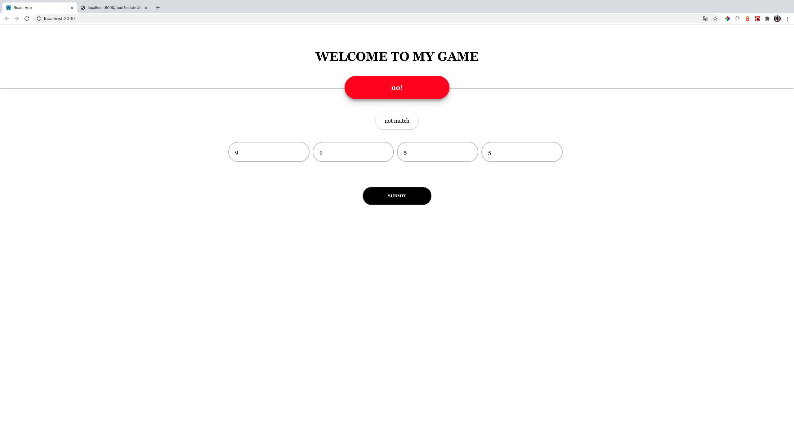

# WorkmotionCreativeTest

### Preview

| [ดึงข้อมูลร้านอาหารโดยใช้ GoogleAPI]() | [ดึงข้อมูลร้านอาหารโดยใช้ GoogleAPI]() |
| :------------------------------------: | :------------------------------------: |
|                         |                         |

| [game24 หน้าเริ่มต้น]() | [game24 กรณีบวกลบคูณหารได้ 24]() |
| :---------------------: | :------------------------------: |
|        |                 |

| [game24 กรณีบวกลบคูณหารได้ 24]() | [game24 กรณีบวกลบคูณหารไม่ได้ 24]() |
| :------------------------------: | :---------------------------------: |
|                 |                    |

### Installation

Download and install [Node.Js](https://nodejs.org/en/download/) for install package.


Clone this project

```bash
$ git clone https://github.com/thiraphat-ps-dev/WorkmotionCreativeTest.git
```

Go to frontend directory

```bash
$ cd WorkmotionCreativeTest
$ cd frontend
```

Run npm install to install node_module

```bash
$ npm install
```

Run Backend server.js in node directory

```bash
$ nodemon node/server.js
```

`API Path:`
/food - use to search data detail food restaurant json
`Example:`
http://localhost:8000/food?input=ร่มไม้ริมนา

/game24 - use to get calculate number1-4 result json
`Example:`
http://localhost:8000/game24?number1=7&number2=9&number3=2&number4=6

Run frontend server with command 

```bash
npm start
```

Go to http://localhost:3000/ 